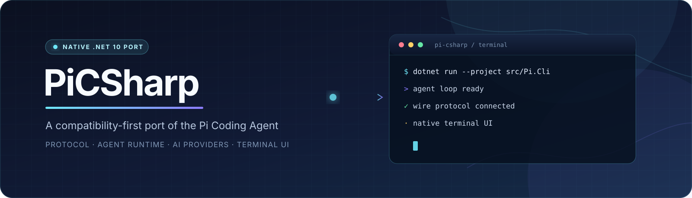
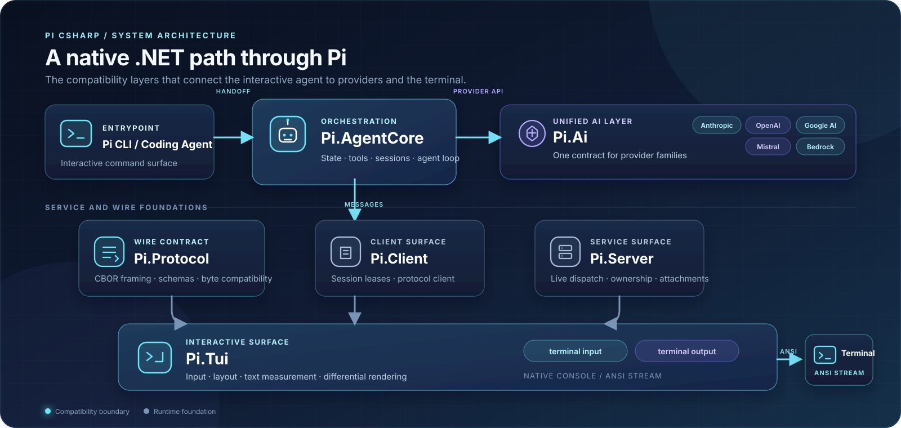

# PiCSharp



PiCSharp is a compatibility-first, native C# / .NET 10 port of the [Pi Coding Agent](https://pi.dev/).
It is designed to bring Pi's protocol, agent runtime, provider integrations, terminal UI, and
eventual extension model to the .NET ecosystem without introducing a Node.js runtime dependency.

> **Status:** active migration, pinned to upstream Pi **v0.84.4**. The compatibility surface is
> delivered in focused milestones; the `pi` executable and several high-level features are still
> under construction.

## What is here

The repository currently contains the following delivered foundations:

- **Wire-compatible protocol** — schemas, CBOR framing, client/server messaging, and session leases.
- **Agent runtime** — stateful agent-loop orchestration with deterministic faux-provider support.
- **AI provider layer** — shared abstractions plus authentication, HTTP/SSE transport, and adapters
  for Anthropic, OpenAI, Google Generative AI, Mistral, and Amazon Bedrock.
- **Terminal UI foundation** — layout/container contracts, text measurement, key input, autocomplete,
  bounded terminal output, and differential rendering.
- **Compatibility documentation** — translation patterns, dependency decisions, session format,
  extension API boundaries, and delegation packets for the remaining work.

The remaining high-risk areas include the complete coding-agent tool surface, interactive editor and
CLI modes, terminal images, and the redesigned extension host. Treat the milestone status and tests
as the source of truth for what is usable today.

## Architecture at a glance



The TypeScript source in [`reference/pi`](reference/pi) is the pinned, read-only behavioral
specification. C# names follow .NET conventions, while serialized names, protocol bytes, defaults,
ordering, and observable behavior remain compatible with upstream.

## Upstream reference

- Home page: [pi.dev](https://pi.dev/)
- Source repository: [earendil-works/pi](https://github.com/earendil-works/pi)
- Pinned release: **v0.84.4**
- Pinned commit: [`b79e4cc834970cca69daebffab7df1da7d1e52c4`](reference/PINNED)

The upstream reference is a Git submodule. Do not update it as part of an ordinary port milestone.

## Requirements

- Windows, macOS, or Linux
- .NET SDK `10.0.303` or a compatible later feature-band SDK
- Git with submodule support

## Quick start

Clone the repository together with its upstream specification:

```bash
git clone --recurse-submodules https://github.com/yanziyang/PiCSharp.git
cd PiCSharp
```

Build the solution:

```bash
dotnet build PiCSharp.slnx
```

Run the non-E2E test suite:

```bash
dotnet test PiCSharp.slnx -- --filter-not-trait "Category=E2E"
```

Run the TUI tests only:

```bash
dotnet test tests/Pi.Tui.Tests
```

Verify formatting before submitting a change:

```bash
dotnet format PiCSharp.slnx --verify-no-changes
```

E2E tests that require provider credentials are intentionally excluded from the normal verification
command. Agent-loop tests use the deterministic faux provider and never call real provider APIs or
spend tokens.

## Repository map

| Path | Responsibility |
| --- | --- |
| `src/Pi.Protocol` | Protocol schemas, CBOR framing, and wire compatibility |
| `src/Pi.Ai.Abstractions` | Provider-neutral model, request, response, and event contracts |
| `src/Pi.Ai` / `src/Pi.Ai.Testing` | Provider integrations and deterministic test support |
| `src/Pi.AgentCore` | Stateful agent-loop runtime |
| `src/Pi.Client` / `src/Pi.Server` | Protocol client/server surfaces and session ownership |
| `src/Pi.Tui` | Terminal UI primitives, input, layout, and rendering |
| `src/Pi.CodingAgent` | Coding-agent integration target |
| `src/Pi.Cli` | `pi` executable target; currently scaffolded |
| `tests` | Ported upstream and conformance-oriented xUnit tests |
| `reference/pi` | Pinned, read-only TypeScript specification |
| `docs` | Architecture, compatibility, dependency, and testing decisions |
| `ÍmplementationKit` | Delegation packets and implementation guidance |

## Porting principles

PiCSharp follows a behavior-first migration model:

1. Read the matching upstream TypeScript source and tests before changing C# code.
2. Preserve protocol bytes, wire names, defaults, ordering, and error behavior.
3. Keep the reference submodule read-only and keep Node.js out of the shipping product.
4. Port upstream tests with their implementation; use golden or differential tests for observable
   terminal, stream, and wire output where appropriate.
5. Keep each milestone within its packet scope and document any deliberate compatibility seam or
   behavior that cannot be reproduced faithfully.

See [`AGENTS.md`](AGENTS.md), [`docs/translation-patterns.md`](docs/translation-patterns.md), and
the design documents under [`docs`](docs) for the complete contribution contract.

## Contributing

Before starting a milestone, read its packet in `ÍmplementationKit/packets/` and confirm the target
paths and frozen paths. Keep commits focused, run the required build, tests, and formatting checks,
and describe any upstream behavior that remains intentionally deferred.

## License

See [`LICENSE`](LICENSE).
